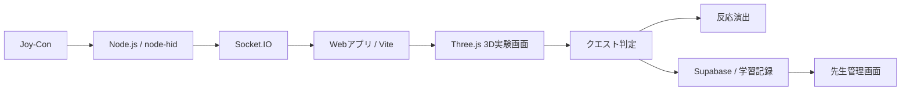

# VCL / Joy-Con Web Input Demo

VCL（Virtual Chemistry Lab）は、Joy-Conを実験器具のように振る・傾けることで、学校では扱いにくい化学反応をWeb上で安全に体験するための理科学習プロトタイプです。

このリポジトリは、VCLで検証している **Joy-Con入力とWeb実験画面の仕様** を公開用に整理したものです。以前の案ではESP32や3Dプリント筐体を使う構成も検討していましたが、現行の発表・検証対象はJoy-Conを使う方式です。


## 現行仕様

VCLでは、PCに接続したJoy-Conを疑似的な試験管・フラスコとして扱います。

生徒がJoy-Conを傾けると、画面上の実験器具も傾きます。薬品を入れ、Joy-Conを振って混ぜると、3D空間で液体の色変化、泡、沈殿、固体の溶解などを表示します。

本物の薬品を使わずに、危険な反応や学校では実施しにくい実験を「自分で操作した感覚」と一緒に学ぶことを目指しています。

## システム構成



### 処理の流れ

1. Windows側でJoy-ConをBluetooth接続する。
2. Node.jsバックエンドが`node-hid`でJoy-Conを検出する。
3. 加速度、ジャイロ、ボタン、スティック入力を解析する。
4. Socket.IOでフロントエンドへリアルタイム送信する。
5. Three.jsで試験管、フラスコ、液体、泡、沈殿などを描画する。
6. クエスト定義に沿って、薬品、混ぜる量、反応演出、成功判定を扱う。
7. 生徒ログイン時は、進捗やトロフィーをSupabaseに保存する。
8. 先生は管理画面から、生徒ごとの実験進捗を確認する。

## 主な機能

| 機能 | 内容 |
| --- | --- |
| Joy-Con入力 | 傾き、振る動き、ボタン、スティック入力を取得する。 |
| 3D実験画面 | Three.jsで試験管、フラスコ、液体、反応エフェクトを表示する。 |
| クエストモード | 用意された実験を選び、指示に沿って進める。 |
| フリーモード | 周期表や薬品を選び、組み合わせを自由に試す。 |
| HD振動 | 薬品セット、注ぐ、混合、反応、成功時にJoy-Conへ振動を返す。 |
| トロフィー | 実験成功などの達成状況を記録する。 |
| 先生管理 | 先生がクラスを作り、生徒IDを発行し、進捗を確認する設計。 |

## 実装済みクエスト

現行のクエストは、薬品を入れてJoy-Conで混ぜる実験を中心にしています。

| ID | 実験名 | 主な反応 |
| --- | --- | --- |
| exp_01 | 酸素の発生実験 | 二酸化マンガンに過酸化水素水を加え、泡の発生を観察する。 |
| exp_02 | 二酸化炭素の発生実験 | 石灰石に塩酸を加え、二酸化炭素の発生を観察する。 |
| exp_03 | 金属の溶け方（アルミニウム） | アルミニウムに塩酸を加え、水素発生や溶解を観察する。 |
| exp_04 | 石灰水と二酸化炭素の反応 | 石灰水が白く濁る様子を観察する。 |
| exp_05 | 硝酸銀水溶液の反応 | 硝酸銀と食塩水から塩化銀の白い沈殿を観察する。 |

加熱、燃焼、炎色反応、蒸発など、火や熱源が必要な実験は現行バージョンでは対象外です。

## クエスト追加の考え方

実験ごとの処理をコードに直接書き込むのではなく、クエスト定義として管理します。

クエスト定義では、次のような情報をまとめて扱います。

- 実験ID、タイトル、説明
- 使用する薬品
- 実験画面に表示するミッション文
- 最初に入っている液体や固体
- 正解として受け付ける薬品名
- 混ぜる量の目標値
- 色変化、泡、沈殿、固体の溶解などの演出
- 成功時のトロフィーID

IDは`exp_01`のように番号で管理します。表示名を変更しても、進捗やトロフィーとの対応が壊れにくくするためです。

## 学校利用の設計

VCLは、生徒が遊ぶだけのアプリではなく、先生が授業で扱える形を目指しています。

| 利用者 | 認証・管理 |
| --- | --- |
| 先生 | Supabase Authのメール認証を使う。クラス作成、生徒ID発行、進捗確認を行う。 |
| 生徒 | メールアドレスは不要。先生が発行した生徒IDと初期パスワードでログインする。 |
| ゲスト | ログインなしで一部の体験を確認できる。 |

先生管理では、クラス、生徒、実験進捗、トロフィーをSupabaseに保存する設計です。

## 使用技術

| 分類 | 技術 |
| --- | --- |
| フロントエンド | Vite, JavaScript, Three.js, Socket.IO Client |
| バックエンド | Node.js, Express, Socket.IO, node-hid |
| データベース / 認証 | Supabase |
| 入力デバイス | Nintendo Joy-Con |
| 保存補助 | LocalStorage |

## 起動構成

VCL本体では、フロントエンドとバックエンドを同時に起動する構成です。

| 種類 | 役割 | URL |
| --- | --- | --- |
| フロントエンド | 画面表示、3D実験室、クエスト画面 | `http://localhost:5173` |
| バックエンド | Joy-Con接続、API、Socket.IO、Supabase連携 | `http://localhost:3000` |

通常は、プロジェクトのルートで次のコマンドを実行します。

```powershell
npm install
npm run dev
```

Supabaseを使う場合は、バックエンド用とフロントエンド用の環境変数を分けて設定します。

```env
# backend/.env
PORT=3000
SUPABASE_URL=your-supabase-url
SUPABASE_SERVICE_ROLE_KEY=your-service-role-key
VCL_JWT_SECRET=replace-with-long-random-secret
```

```env
# frontend/.env
VITE_SUPABASE_URL=your-supabase-url
VITE_SUPABASE_ANON_KEY=your-anon-key
```

`SUPABASE_SERVICE_ROLE_KEY`はサーバー側だけで使います。ブラウザ側へ置いてはいけません。

## 現在の注意点

- この公開リポジトリは、現時点ではVCLの仕様説明とJoy-Con入力デモの整理を目的にしています。
- Joy-Conはブラウザから直接読むのではなく、Node.jsバックエンドの`node-hid`経由で扱います。
- Joy-ConのペアリングはWindowsのBluetooth設定で先に行います。
- Joy-ConのL/Rと試験管/フラスコの割り当ては、現行では検出順に依存します。
- ESP32を使った専用デバイスは試作・検討対象であり、現行の発表対象はJoy-Con方式です。

## 開発中に試したこと

最初は、カメラによる画像認識やArUcoマーカーで、試験管やフラスコの位置・傾きを読み取る方法も検討しました。

しかし、教室で使うことを考えると、カメラ位置、照明、マーカーの見え方によって認識が不安定になりやすいことが分かりました。そこで、加速度・ジャイロ・ボタン入力を持つJoy-Conに切り替え、振る・傾ける・押す操作を直接取得する方式にしました。

危険だからできない、で終わらせない。

VCLは、理科の実験をもう一度「やってみたい」に戻すためのプロトタイプです。
