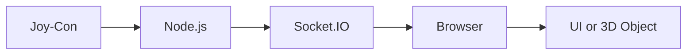

# Joy-Con Web Input Demo

Joy-Conの傾きや動きをWeb画面にリアルタイム反映する技術デモです。

VCL本体のチーム開発コードは公開せず、外部デバイス入力をWebアプリに接続する考え方だけを小さく再構成する想定です。

## Purpose

このデモの目的は、Joy-Conの入力をNode.js側で取得し、Socket.IOでフロントエンドへ送信し、Web画面上の表示に反映する流れを示すことです。

VCLでは、この仕組みを使って試験管やフラスコを傾ける操作に応用しました。

## Architecture

## Tech Stack

- Node.js
- Socket.IO
- JavaScript
- HTML / CSS
- Three.js or Canvas

## What This Demo Shows

- Joy-Conの入力を取得する
- 取得した値を補正する
- 小さな揺れを無視して画面のブレを減らす
- Socket.IOでリアルタイムに送る
- フロントエンドで受け取り、画面上のオブジェクトを動かす

## Relation to VCL

VCLでは、Joy-Conを試験管やフラスコのように扱い、傾ける、振る、混ぜるという操作をWeb上の実験体験に反映しました。

このデモでは、チーム開発本体のコードではなく、その中で使った技術要素を公開可能な範囲で小さく再現します。

## Roadmap

- 最小構成のNode.jsサーバーを作る
- Socket.IOでブラウザへ値を送る
- 画面上のオブジェクトを傾きに合わせて動かす
- 起動方法を追加する
